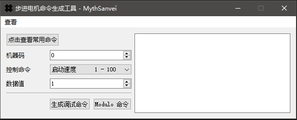

# 星火 STD2611M 控制器命令生成工具

## 2019/06/25 更新记录
- 初始版本

### 支持功能
- 选择机器码、对应控制命令以及数据值，程序通过 CRC16/MODBUS 验证算法自动计算出对应的调试控制命令以及 Modulo 服务器所需的控制命令数据格式。
- 添加常用命令汇总窗口
- 添加关于窗口

#### 依赖
- Qt 5.12.0
- Visual Studio 2015